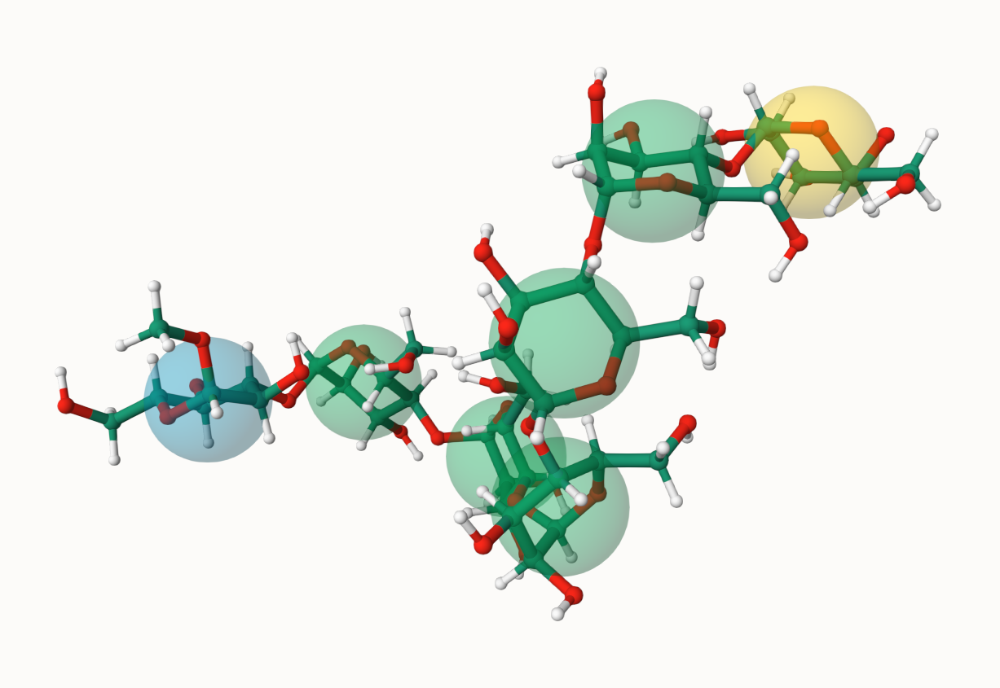

This study note documents the process of installing [Open Babel](https://openbabel.org/index.html) and [GlyLES](https://github.com/kalininalab/GlyLES), and then converting glycan IUPAC names into 3D structures using the General Amber Force Field (GAFF) and Open Babel.



*Example of 3D structure for glycan plotted through [GLyCAM](https://glycam.org/).*

## 1. Installing OpenBabel Without sudo Access

Here's a complete guide to installing OpenBabel from source without requiring sudo or administrative privileges. Before installing, make sure your system meets all [requirements listed in the official documentation](https://openbabel.org/docs/Installation/install.html).

### Step 1: Download and Extract OpenBabel

```bash
# Download OpenBabel (adjust version as needed)
wget https://github.com/openbabel/openbabel/releases/download/openbabel-3-1-1/openbabel-3.1.1-source.tar.bz2

# Extract the archive
tar xvjf openbabel-3.1.1-source.tar.bz2
```

### Step 2: Configure the Build

```bash
# Create a build directory
mkdir build

# Enter the build directory
cd build

# Configure with CMake, specifying a custom install prefix
cmake ../openbabel-openbabel-3-1-1 -DCMAKE_INSTALL_PREFIX=$HOME/openbabel
```

For users with administrative privileges, OpenBabel can be installed system-wide by simply omitting the `-DCMAKE_INSTALL_PREFIX` flag during configuration.

### Step 3: Compile OpenBabel

```bash
# Compile (use -j<N> for parallel build with N cores)
make -j4
```

### Step 4: Set Environment Variables

The compiled binaries can be used directly from the build directory without installation. You'll need to set up your environment to find the executables and plugins:

```bash
# Edit your ~/.profile or ~/.bashrc
vi ~/.profile
```

Add these lines:

```bash
# Add OpenBabel to PATH
export PATH=$PATH:/path/to/OpenBabel/build/bin

# Set OpenBabel environment variables
export LD_LIBRARY_PATH=${LD_LIBRARY_PATH:+$LD_LIBRARY_PATH:}/data/yuhhong/OpenBabel/build/lib
export BABEL_LIBDIR=/data/yuhhong/OpenBabel/build/lib/
export BABEL_DATADIR=/data/yuhhong/OpenBabel/openbabel-3.1.1/data/
```

Replace `/path/to/OpenBabel` with your actual path.

### Step 5: Apply the Environment Changes

```bash
source ~/.profile
```

### Step 6: Test OpenBabel

```bash
# Check the version
obabel -V

# List supported formats
obabel -L formats
```

## 2. Converting IUPAC Names to 3D Structures

Besides Open Babel, we also need GlyLES to convert IUPAC names into SMILES strings.

GlyLES can be easily installed with `pip install glyles`. For more details, see the implementation repository: [https://github.com/kalininalab/GlyLES](https://github.com/kalininalab/GlyLES).

Then we can start coding! Here's a simple example to convert an IUPAC name to a 3D structure:

<script src="https://gist.github.com/JosieHong/813a9e5bbbe3d08bb110a4f21b143886.js"></script>
