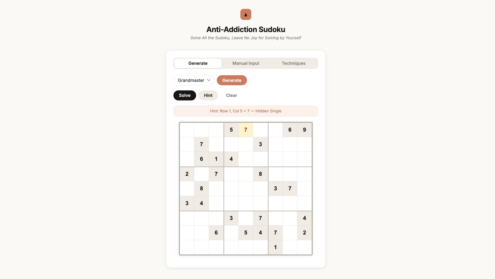

Sudoku is one of the most popular logic puzzles in the world — a 9×9 grid that must be filled so that every row, column, and 3×3 box contains each digit from 1 to 9 exactly once. While people spend hours wrestling with hard puzzles, a computer can crack any Sudoku in milliseconds. This post walks through the human solving techniques behind the puzzle, how constraint programming formalizes them, and my project [Anti-addiction Sudoku](https://github.com/josiehong/anti-addiction_sudoku) — a Python tool that solves any puzzle instantly and even explains its reasoning step by step.

## I. Human Solving Techniques [[2]](#references)

Human solvers build up a set of *candidate* digits for each empty cell — the digits that are still legal given the current state of the board. Techniques progressively eliminate candidates or place digits by spotting patterns.

### 1. Naked Single

The simplest technique: a cell has only **one candidate remaining**. Because all other digits are already ruled out by its row, column, or box, that digit must go there. This is the first thing any solver checks.

### 2. Hidden Single

A digit that can appear in only **one cell within a group** (row, column, or box) must go in that cell, even if that cell still has other candidates. The digit is "hidden" among others — you have to look at the group, not just the cell.

### 3. Naked Pairs / Naked Triples

If **N cells in a group share exactly N candidates** between them (and no others), those digits must occupy those N cells. Every other cell in the group can have those candidates eliminated. For example, two cells that both show only {4, 7} mean no other cell in that row can be 4 or 7.

### 4. Hidden Pairs / Hidden Triples

The complement of naked pairs: if **N digits are confined to exactly N cells** within a group, those cells can have all *other* candidates removed. The pair or triple is "hidden" because the cells appear to have many candidates at first glance.

### 5. Pointing Pairs (Box-Line Reduction)

When a candidate digit within a 3×3 box is restricted to a single row or column, it can be eliminated from the rest of that row or column outside the box. The box "points" at the line.

### 6. X-Wing

Consider a digit that appears in exactly **two cells in each of two rows, and those cells share the same two columns**. The digit must go in one of those two columns for both rows, so it can be eliminated from all other cells in those columns. X-Wing is the gateway to more advanced "fish" patterns.

### 7. Swordfish

The X-Wing idea extended to **three rows and three columns**. If a digit appears in at most three cells across three rows, and those cells all fall within the same three columns, the digit can be eliminated from every other cell in those three columns.

### 8. Backtracking

When no deterministic technique applies, a solver can **guess a candidate, propagate constraints, and backtrack** if a contradiction is reached. This is guaranteed to find a solution (or prove none exists) but gives no human-readable explanation. In practice, puzzles marketed as "hard" or "expert" often require this step.

| Technique | What it spots | Difficulty |
|---|---|---|
| Naked Single | One candidate in a cell | Beginner |
| Hidden Single | Digit with one valid cell in a group | Beginner |
| Naked Pairs/Triples | N cells share N candidates | Intermediate |
| Hidden Pairs/Triples | N digits confined to N cells | Intermediate |
| Pointing Pairs | Box digit confined to one line | Intermediate |
| X-Wing | Digit in 2 rows × 2 columns | Advanced |
| Swordfish | Digit in 3 rows × 3 columns | Advanced |
| Backtracking | Brute-force search with pruning | Fallback |

## II. Constraint Programming

All of the techniques above are really special cases of a single idea: **constraint propagation**. Constraint programming (CP) makes this formal [[1]](#references).

A Sudoku puzzle is a **Constraint Satisfaction Problem (CSP)** defined by:

- **Variables**: the 81 cells, each with a domain {1, …, 9}.
- **Constraints**: every row, column, and box must contain each digit exactly once — expressed as *AllDifferent* constraints over the 27 groups.

The CP solver interleaves two operations:

1. **Propagation** — applying constraints to shrink domains. Arc consistency (AC-3) and its relatives automate this: whenever a cell's domain is reduced, the change is propagated to peers, which may trigger further reductions. Naked singles and hidden singles fall out naturally.
2. **Search** — when propagation stalls, the solver picks an unassigned variable (typically the one with the smallest domain — *minimum remaining values* heuristic) and branches on a candidate value, then resumes propagation. This is the formal version of backtracking.

The beauty of CP is that higher-level human techniques like X-Wing or Swordfish are not needed as separate rules — they emerge from constraint propagation on a richer constraint model, or they're subsumed by the search. Implementing them explicitly in code, however, makes the solver's hints interpretable to a human.

## III. Anti-addiction Sudoku

I built [Anti-addiction Sudoku](https://github.com/josiehong/anti-addiction_sudoku) as a tongue-in-cheek cure for Sudoku addiction: if a computer can solve any puzzle in milliseconds, why spend hours on one yourself? The project ships as a Python package with both a web UI and a CLI.



*The Anti-addiction Sudoku web UI, showing a Grandmaster puzzle with a Hidden Single hint highlighted.*

### What it does

- **Solve** — fills the entire board instantly given any valid puzzle.
- **Hint** — fills one cell and names the technique used (e.g., *"Row 4, Col 7 = 3 — X-Wing"*), walking through the human hierarchy before falling back to backtracking.
- **Generate** — produces puzzles at four difficulty levels: Easy, Hard, Master, Grandmaster. Difficulty is tuned by which techniques are required to solve the puzzle.

### Installation & usage

```bash
# Install from PyPI
pip install anti-sudoku

# Solve from a string (dots = blank cells)
anti-sudoku solve --input "53..7...."

# Get a step-by-step hint
anti-sudoku serve   # opens the web UI at http://localhost:8000
```

The Python API is equally simple:

```python
from anti_sudoku import solve, hint, generate

puzzle = generate(difficulty="grandmaster", seed=42)
solution = solve(puzzle)

h = hint(puzzle)
# {"row": 3, "col": 6, "value": 7, "technique": "Hidden Single"}
```

### Design choices

The solver applies techniques in order of increasing complexity — Naked Single → Hidden Single → Naked/Hidden Pairs/Triples → Pointing Pairs → X-Wing → Swordfish — and only falls back to backtracking when all deterministic techniques are exhausted. This ordering serves two purposes: it mirrors how a skilled human would think, and it keeps hints meaningful. A pure CP engine would be faster, but it would have nothing educational to say.

## References

1. Simonis, H. (2005). Sudoku as a constraint problem. *CP Workshop on Modeling and Reformulating Constraint Satisfaction Problems*, 12, 13–27.
2. Sudoku Bliss Team. (2026, January 29). Sudoku tips and strategies. *Sudoku Bliss*. [https://sudokubliss.com/guides/sudoku-tips-and-strategies](https://sudokubliss.com/guides/sudoku-tips-and-strategies)
