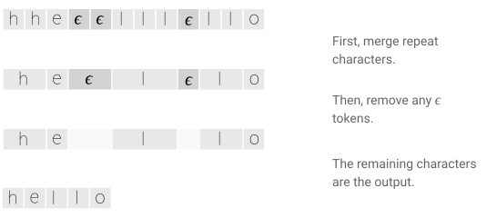
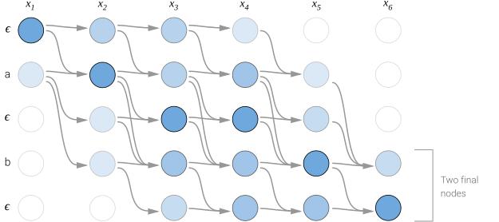
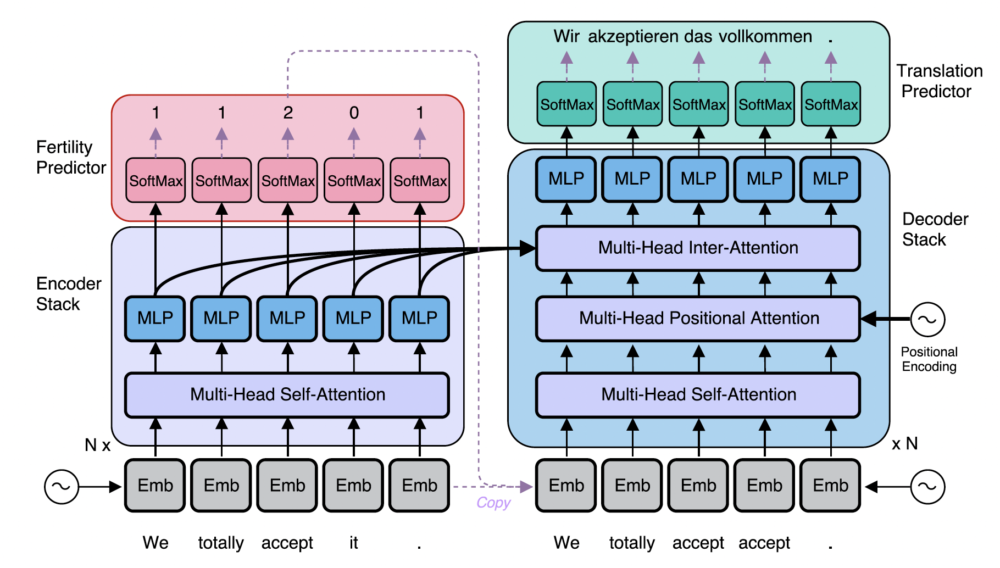
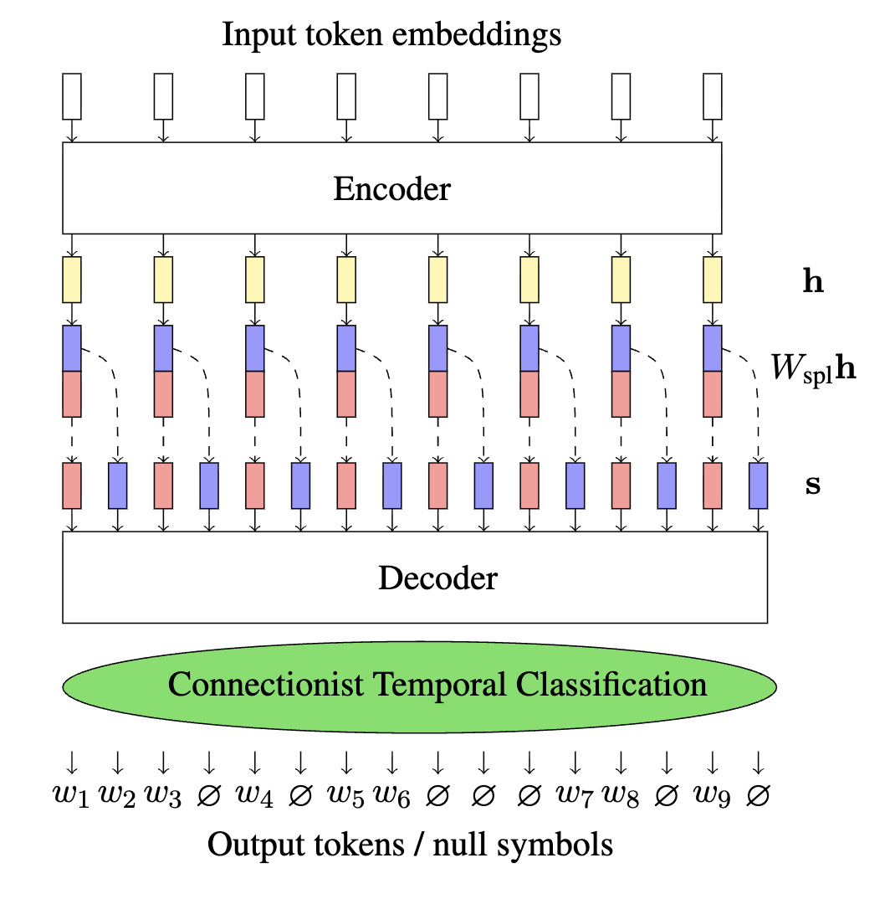
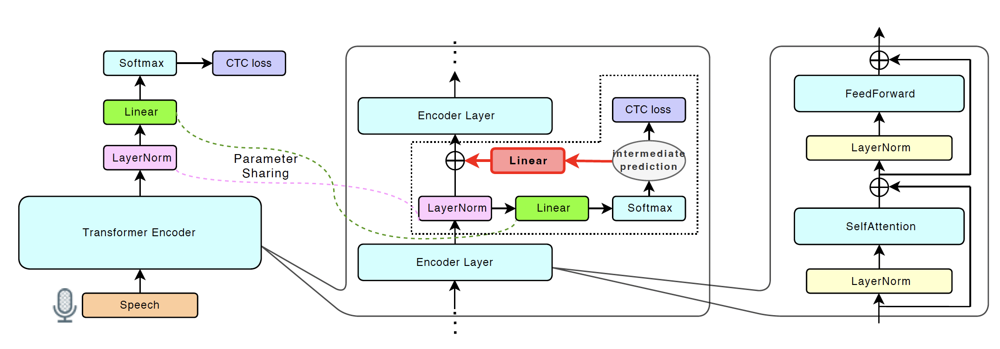
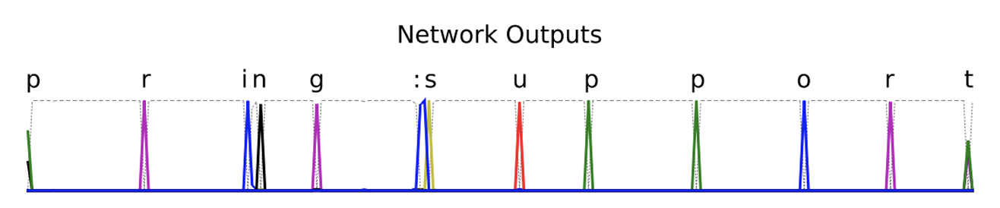
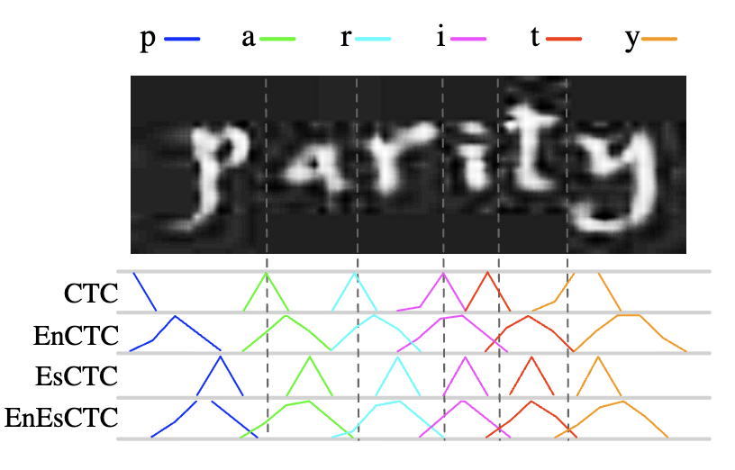
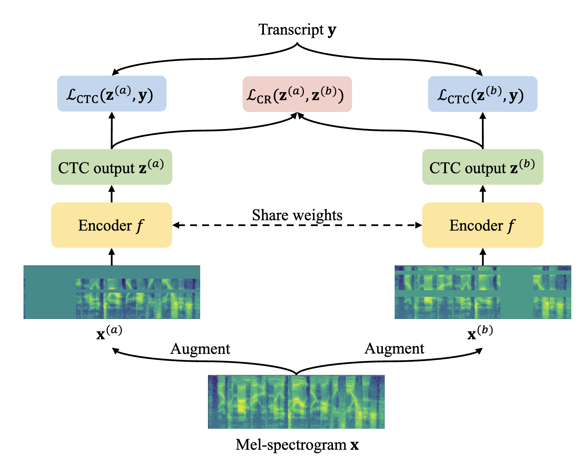

- [1. Connectionist Temporal Classification (CTC) in a nutshell](#1-connectionist-temporal-classification-ctc-in-a-nutshell)
  - [1.1 From unaligned pairs to blanks and collapsing](#11-from-unaligned-pairs-to-blanks-and-collapsing)
  - [1.2 The CTC objective and forward-backward recursion](#12-the-ctc-objective-and-forward-backward-recursion)
- [2. CTC properties, limitations, and recent works](#2-ctc-properties-limitations-and-recent-works)
  - [2.1 Conditional independence assumption and 'fertility'](#21-conditional-independence-assumption-and-fertility)
  - [2.2 Conditioning on intermediate predictions](#22-conditioning-on-intermediate-predictions)
  - [2.3 Peakiness and regularizations](#23-peakiness-and-regularizations)
- [3. Conclusion](#3-conclusion)
- [References](#references)

## 1. Connectionist Temporal Classification (CTC) in a nutshell

### 1.1 From unaligned pairs to blanks and collapsing

In tasks such as speech recognition, the input is an audio clip and the output is a transcript. The model reads the input frame by frame and outputs a label for each frame, using information from the prefix. But the number of frames rarely matches the number of labels (audio spanning many frames may correspond to a single word 'hello'), so we need an alignment.

Encoder-decoder models avoid this problem. Each output step sees the whole input embedding plus the prefix, so no explicit alignment is needed. In a streaming setting, however, we don't have the whole input up front.

<figure>
  
  <figcaption style="text-align: center;">An example of CTC alignment, from <a href="#references">[1]</a>.</figcaption>
</figure>

Connectionist Temporal Classification (CTC) solves this with a simple collapsing rule [[2]](#references). First merge repeated characters, then remove any blank ($\epsilon$) tokens. A frame-level output is a valid alignment as long as it collapses to the target sequence, which means blanks and repeated labels are both allowed, as in the figure above. Note that the merging step would incorrectly collapse a genuine repeat such as `ll` into a single `l`, so a repeated label must be separated by a blank and written as `l`$\epsilon$`l`. This separating blank consumes an extra frame, but frames far outnumber labels, so there is room to spare.

### 1.2 The CTC objective and forward-backward recursion

A *path* $\pi = (\pi_1, \dots, \pi_T)$ is a frame-level label sequence of length $T$, where each $\pi_t$ is drawn from $A \cup \{\epsilon\}$ and $A$ is the label alphabet. The collapsing map $B$ sends a path to a target sequence by merging consecutive duplicates and then removing blanks. CTC defines the probability of a target $y$ as the sum over *all* paths that collapse to it,

$$
p(y \mid x) = \sum_{\pi \in B^{-1}(y)} \prod_{t=1}^{T} p_t(\pi_t \mid x),
$$

where $p_t(\cdot \mid x)$ is the model's output distribution at frame $t$, and the training loss is $-\log p(y \mid x)$. Two features of this definition matter for the rest of the post. First, the per-frame product $\prod_t p_t(\pi_t \mid x)$ encodes a conditional independence assumption. Given the input $x$, each frame's prediction is made independently, so the model carries no explicit dependence between output tokens. Second, the set $B^{-1}(y)$ grows exponentially in $T$, so evaluating the sum by enumeration is hopeless.

The sum is nonetheless tractable because $B$ is monotonic (frames align to labels left to right), so it can be computed by dynamic programming in $O(TU)$ time, where $U$ is the length of $y$, exactly as in the HMM forward-backward algorithm. Insert a blank between every pair of labels in $y$ (and at both ends) to form an extended sequence $l'$ of length $2U + 1$; this lets the recursion track whether two labels are separated by a blank. Moving from one frame to the next, a path can *stay* at the same position in $l'$, *advance* one step, or *skip* over a blank to the next label. Define the forward variable $\alpha_t(s)$ as the total probability of all paths that have consumed the first $t$ frames and reached position $s$ in $l'$.

<figure>
  
  <figcaption style="text-align: center;">Valid paths for the target 'ab', with frames left to right and the extended sequence ε a ε b ε top to bottom, from <a href="#references">[1]</a>.</figcaption>
</figure>

The three moves give the recursion

$$
\alpha_t(s) = p_t(l'_s \mid x) \times
\begin{cases}
\alpha_{t-1}(s) + \alpha_{t-1}(s-1) & \text{if } l'_s = \epsilon \text{ or } l'_s = l'_{s-2}, \\
\alpha_{t-1}(s) + \alpha_{t-1}(s-1) + \alpha_{t-1}(s-2) & \text{otherwise.}
\end{cases}
$$

The extra term in the second case is the skip. A path may jump over a blank only when the two surrounding labels are distinct, which forces a separating blank between genuinely repeated labels. Terms with $s < 1$ are treated as zero, and at $t = 1$ only the first blank and the first label are reachable, so $\alpha_1(1) = p_1(\epsilon \mid x)$, $\alpha_1(2) = p_1(l'_2 \mid x)$, and $\alpha_1(s) = 0$ otherwise.

A symmetric backward variable $\beta_t(s)$ is defined the same way from the end of the sequence, and $p(y \mid x) = \alpha_T(2U+1) + \alpha_T(2U)$, the total probability of paths ending on the final blank or the last label [[3]](#references). Combining $\alpha$ and $\beta$ gives the gradient in closed form, so the loss trains with ordinary backpropagation.

This tractable, differentiable loss is what made CTC practical. However, the conditional independence baked into the per-frame product is also its central weakness, and it is the starting point for much of the recent work below.

## 2. CTC properties, limitations, and recent works

### 2.1 Conditional independence assumption and 'fertility'

Sequence-to-sequence tasks are typically handled by an encoder-decoder model whose decoder conditions each output token on the previously generated ones. This autoregressive dependency, however, forces decoding to run sequentially (each token must wait for its predecessors), which makes inference slow. To reduce this latency, Gu et al. [[4]](#references) proposed a non-autoregressive model for machine translation that generates all target tokens in parallel. Removing the autoregressive dependency means the outputs are now conditionally independent given the source, exactly the assumption CTC makes; it also means the target length can no longer be decided implicitly by an end-of-sequence token, so the model must predict it explicitly. Determining how many target tokens each source token produces is itself an alignment problem, and Gu et al. address it with *fertilities*, latent variables predicted from the encoder states that give exactly these counts [[4]](#references).

The per-position product $\prod_t p_t(y_t \mid x)$ is convenient, but it comes at a price. Each output position is predicted independently given the input, so the model cannot coordinate its choices across positions, and natural targets are rarely unimodal. Translating "Thank you." into German, for instance, admits at least two good outputs, "Danke schön" and "Vielen Dank." A model that places high probability on both, yet decides each position on its own, can just as easily emit the incoherent mixtures "Danke Dank" or "Vielen schön." This coordination failure is known as the *multimodality problem*, where conditional independence lets probability mass leak onto blends of otherwise valid outputs. The first attempt to relax it, and the origin of this subsection's title, is the fertility model above, which supplies the missing coordination through a latent variable.

<figure>
  
  <figcaption style="text-align: center;">The non-autoregressive Transformer. Predicted fertilities (here 1, 1, 2, 0, 1) tell how many times each source token is copied into the decoder input, and all target tokens are then decoded in parallel, from <a href="#references">[4]</a>.</figcaption>
</figure>

Fertility solves the length and decoder-input problems, but at the cost of an explicit latent variable that must be predicted, supervised, and either searched over or sampled at inference. Libovický and Helcl [[5]](#references) observed that CTC offers a more direct route. Instead of copying each source embedding according to a predicted fertility (whose sum also fixes the target length), they upsample the encoder output to a sequence longer than any plausible target and apply the CTC loss directly, letting the model emit a frame-level sequence that collapses to the translation. Because CTC marginalizes over all alignments, the target length is never predicted at all. It falls out of the collapsing rule.

<figure>
  
  <figcaption style="text-align: center;">Non-autoregressive translation with CTC. Each encoder state is split into several sub-states to upsample the sequence beyond the target length, and the CTC loss maps the result to output tokens or nulls, from <a href="#references">[5]</a>.</figcaption>
</figure>

### 2.2 Conditioning on intermediate predictions

Adopting CTC does not make the multimodality problem go away, though. CTC still factorizes as $\prod_t p_t(\pi_t \mid x)$, so the conditional independence assumption, and the coordination failure it causes, is inherited wholesale. CTC removes the need to predict length, but on its own it does nothing to let output positions inform one another. That gap is what the next line of work targets, and it brings us back to speech recognition, where the idea is to condition later predictions on the model's own earlier ones.

The first step in this direction, *Intermediate CTC* [[6]](#references), is simple. A CTC model stacks many encoder layers and applies the CTC loss only at the top. Intermediate CTC additionally attaches a CTC loss, with the same targets, to the output of one or more intermediate layers, and adds these auxiliary terms to the objective. Nothing about the architecture or the decoding changes, so there is no overhead at inference. Forcing the network to commit to a rough transcription partway up the stack regularizes training and improves accuracy on its own. It does not touch the conditional independence assumption, however. The intermediate predictions supervise the network but are never fed back into it, so the final layer still predicts every position independently.

*Self-conditioned CTC* [[7]](#references) closes that gap with one small change. It keeps the intermediate CTC losses, but adds each intermediate prediction back into the input of the next encoder layer, during both training and inference. A later layer reads an earlier layer's guess at the full label sequence, so its own prediction is no longer independent of what the model believes elsewhere in the sequence. If an intermediate layer leans toward "Danke schön," that bias is carried forward rather than being decided afresh at every position. The assumption is relaxed without an autoregressive decoder or an external language model; the encoder simply conditions on its own successive predictions. The result keeps the simple architecture and fast parallel decoding that make CTC attractive, while chipping away at its central weakness.

<figure>
  
  <figcaption style="text-align: center;">Self-conditioned CTC. The dotted block attaches an intermediate CTC loss partway up the encoder (Intermediate CTC), and the red path adds the intermediate prediction back into the next encoder layer, from <a href="#references">[7]</a>.</figcaption>
</figure>

The methods in these two subsections share a design goal. They relax conditional independence while keeping CTC's non-autoregressive, decoder-free inference. Two other routes give that constraint up instead. The more radical is the RNN transducer [[11]](#references), which adds a *prediction network*, an internal language model over previously emitted tokens, so that each output depends on the ones before it; this restores coordination directly but sacrifices the parallel decoding that motivates CTC. A lighter route intervenes only at inference. Because a plain CTC model has no internal language model, decoding is commonly paired with an external one through shallow fusion or a WFST (Weighted Finite-State Transducer) decoding graph, injecting token dependencies after training rather than during it [[12]](#references). We focus on the methods above because they leave CTC intact.

### 2.3 Peakiness and regularizations

A trained CTC model rarely spreads its probability smoothly over time. Instead it emits blank on the vast majority of frames and fires each real label as a narrow spike on one or two frames, the *peaky* behavior noted since Graves' original work. Empirically this is not fatal for recognition, but it makes CTC's frame-level posteriors poorly calibrated and unreliable as alignments, and it hints that the model is collapsing onto a single path rather than learning the full distribution over valid alignments.

<figure>
  
  <figcaption style="text-align: center;">Peaky outputs of a trained CTC model. Each label fires as a spike one or two frames wide, while the dashed boxes mark the much longer ground-truth segments, from <a href="#references">[8]</a>.</figcaption>
</figure>

Zeyer, Schlüter, and Ney [[8]](#references) give this phenomenon a formal footing. They analyze the gradient-descent convergence of the CTC objective and show that peakiness falls out of the training criterion itself. From a uniform initialization, gradient descent tends toward solutions that concentrate all mass on a single dominant alignment. On a deliberately trivial example they prove that a feed-forward network trained with CTC converges to peaky behavior with a 100% error rate, so peakiness is a property of the loss and its optimization dynamics, not of a particular dataset or architecture. Their analysis also reframes the role of blank. They argue CTC works well *because* of the blank label, and that peakiness is entangled with how blank dominates the alignment set. They also show that related criteria, such as a model with an explicit label prior, do not exhibit the same peaky collapse, which points toward where mitigations should look.

The most direct mitigation attacks the collapse onto a single path head-on. Liu, Jin, and Zhang [[9]](#references) observe that as CTC training proceeds, the conditional entropy over feasible paths drops sharply, meaning the model becomes overconfident and stops exploring alternative alignments, and they propose three remedies. *EnCTC* adds a maximum-conditional-entropy term to the loss, $L_{\text{EnCTC}} = L_{\text{CTC}} - \lambda\,H(\pi \mid y, x)$, which penalizes overly peaky path distributions and keeps probability mass on alignments near the dominant one. Two variants, *EsCTC* and *EnEsCTC*, instead prune the feasible set with an equal-spacing constraint on where labels may occur, without or with the entropy term. The paper gives polynomial-time dynamic-programming algorithms for all three, so they remain as tractable as the original CTC recursion, and on scene text recognition they consistently improve over the CTC baseline without any change to the training setup.

<figure>
  
  <figcaption style="text-align: center;">Label distributions over frames for the word 'parity'. Plain CTC concentrates on narrow peaks, while EnCTC, EsCTC, and EnEsCTC spread probability over wider, better-placed segments, from <a href="#references">[9]</a>.</figcaption>
</figure>

More recent work suppresses peaky distributions as a side effect of consistency regularization rather than through an explicit entropy term. Yao et al. [[10]](#references) propose *CR-CTC* (Consistency-Regularized CTC), which feeds two differently augmented views of the same input mel-spectrogram through the model and enforces consistency between the two resulting CTC distributions. The authors interpret the effect as self-distillation between the two augmented sub-models and, most relevant here, as suppressing the extremely peaky CTC distributions, which reduces overfitting and improves generalization. Enforcing agreement pushes the model toward the average of the two branches' predictions, yielding smoother emission distributions rather than sharp single-frame spikes. On LibriSpeech, Aishell-1, and GigaSpeech, CR-CTC lifts plain CTC to results competitive with transducer and CTC/AED systems, narrowing much of the gap that motivated the alternatives in Section 2.1 while keeping CTC's simple, decoder-free, parallel inference.

<figure>
  
  <figcaption style="text-align: center;">CR-CTC. Two augmented views of the same mel-spectrogram pass through weight-shared encoders, each trained with its own CTC loss, while a consistency loss ties the two output distributions together, from <a href="#references">[10]</a>.</figcaption>
</figure>

## 3. Conclusion

CTC starts from a simple idea. Allow blanks and repeats, define validity by a collapsing rule, and sum over every alignment that survives the collapse. The forward-backward recursion makes that sum and its gradient cheap, which turned an alignment problem into an ordinary differentiable loss and made CTC a workhorse for speech recognition and, later, for parallel decoding in translation.

Its two best-known flaws are both visible in the objective itself. The per-frame product assumes conditional independence, so the model cannot coordinate its outputs, and the methods of Sections 2.1 and 2.2 relax that assumption step by step. Fertility buys coordination with a latent variable, CTC-based non-autoregressive translation marginalizes the length problem away, Intermediate CTC supervises the middle of the encoder, and Self-conditioned CTC feeds those intermediate predictions back in. Training dynamics add the second flaw, peakiness, where gradient descent collapses the alignment distribution onto a single dominant path. Zeyer et al. [[8]](#references) explain why this happens, and the regularizers [[9, 10]](#references) counteract it by penalizing low entropy, pruning alignments, or enforcing consistency across augmented views. Both stories point the same way. CTC's simplicity is worth keeping, and the interesting work lies in relaxing its assumptions without giving that simplicity up.

## References

[1] Hannun, "Sequence Modeling with CTC", Distill, 2017.

[2] Graves, Alex, et al. "Connectionist temporal classification: labelling unsegmented sequence data with recurrent neural networks." Proceedings of the 23rd international conference on Machine learning. 2006.

[3] Kawakami, Kazuya. Supervised sequence labelling with recurrent neural networks. Diss. Ph. D. thesis, 2008.

[4] Gu, Jiatao, et al. "Non-autoregressive neural machine translation." arXiv preprint arXiv:1711.02281 (2017).

[5] Libovický, Jindřich, and Jindřich Helcl. "End-to-end non-autoregressive neural machine translation with connectionist temporal classification." Proceedings of the 2018 Conference on Empirical Methods in Natural Language Processing. 2018.

[6] Lee, Jaesong, and Shinji Watanabe. "Intermediate loss regularization for CTC-based speech recognition." ICASSP 2021-2021 IEEE International Conference on Acoustics, Speech and Signal Processing (ICASSP). IEEE, 2021.

[7] Nozaki, Jumon, and Tatsuya Komatsu. "Relaxing the conditional independence assumption of CTC-based ASR by conditioning on intermediate predictions." arXiv preprint arXiv:2104.02724 (2021).

[8] Zeyer, Albert, Ralf Schlüter, and Hermann Ney. "Why does CTC result in peaky behavior?." arXiv preprint arXiv:2105.14849 (2021).

[9] Liu, Hu, Sheng Jin, and Changshui Zhang. "Connectionist temporal classification with maximum entropy regularization." Advances in Neural Information Processing Systems 31 (2018).

[10] Yao, Zengwei, et al. "Cr-ctc: Consistency regularization on ctc for improved speech recognition." International Conference on Learning Representations. Vol. 2025. 2025.

[11] Graves, Alex. "Sequence transduction with recurrent neural networks." arXiv preprint arXiv:1211.3711 (2012).

[12] Mohri, Mehryar, Fernando Pereira, and Michael Riley. "Weighted finite-state transducers in speech recognition." Computer Speech & Language 16.1 (2002): 69-88.
