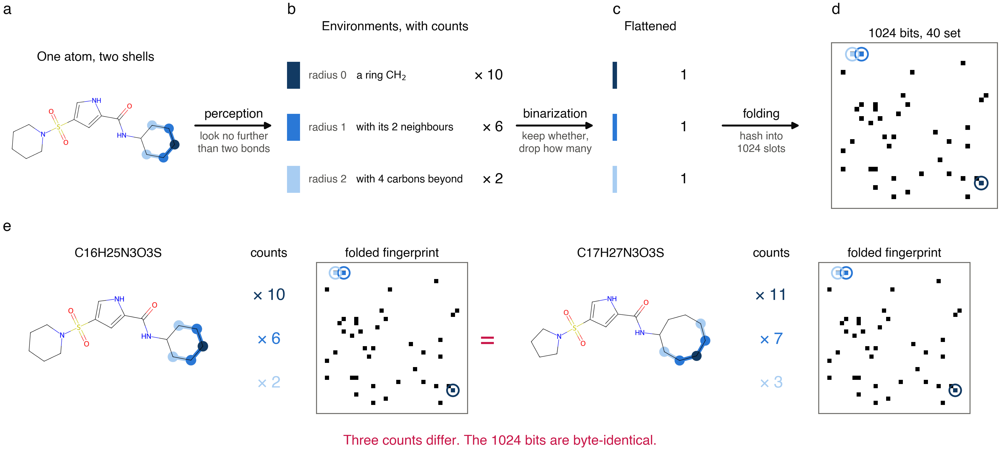
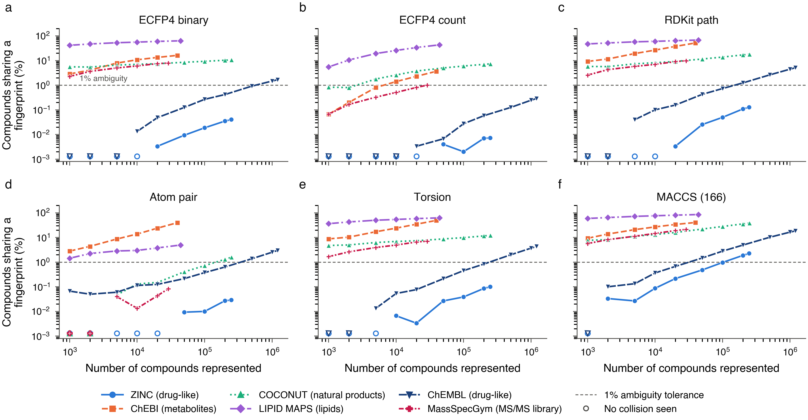
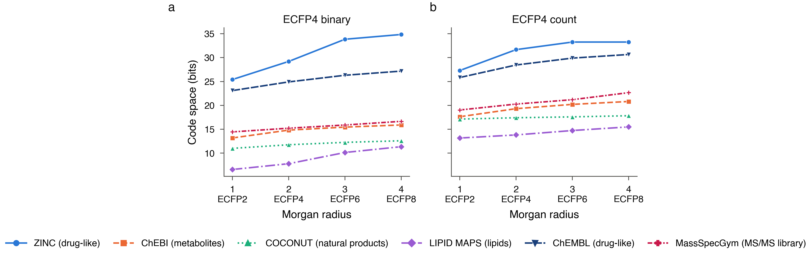
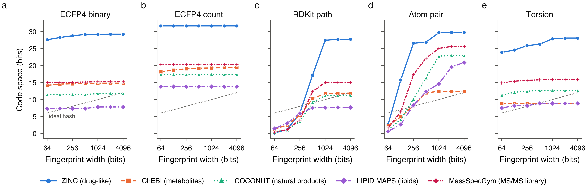

A molecular fingerprint turns a structure into a fixed string of bits; the common kind, ECFP4 [[1]](#references), uses 1024 of them. The string is cheap to store and instant to compare, and it stands in for the molecule in similarity search, clustering and machine learning.

Because the string is short and the number of possible molecules is not, two different compounds can end up with the same bits. That is a *collision*. If the fingerprint is being used as a database key, a collision means two compounds the system can no longer tell apart. This post measures how often that happens on real compound libraries. The answer depends far more on the library than on the fingerprint.

## Representation and identification are different jobs

A fingerprint is a *representation*: a compressed summary of a structure, built so that similar molecules get similar bit patterns. An *identifier* needs the opposite. Every distinct compound must get a distinct code, so any information thrown away is a defect rather than a feature. Using a fingerprint as a key asks it for a property it was never built to have.

The question has a direct application in spectrum annotation. An unknown's tandem mass spectrum is first searched against a spectral library, and that settles most cases where a reference spectrum exists. When none does, one well-established fallback is to predict a molecular fingerprint from the spectrum and score candidate structures from a database by how well their fingerprints match the prediction [[2]](#references). The question studied here sits downstream of the predictor: two candidates with identical fingerprints receive identical scores, so no prediction, however good, can rank one above the other. The fingerprint's resolution caps how specific the annotation can be, and choosing it with that in mind is one place the approach can still improve.

Throughout, a compound is **ambiguous** when at least one other compound in the same library has a byte-identical fingerprint.

## The fingerprints

Six fingerprints were tested, all computed with [RDKit](https://www.rdkit.org). Five are hashed: they enumerate some family of substructures and hash each into a fixed number of slots, 1024 unless stated otherwise. They differ in which substructures they look at.

**ECFP4, binary.** The Morgan fingerprint at radius 2, the default almost everywhere. It is built in three steps, and each one throws information away. *Perception*: for every atom, record the circular environment out to one bond, then two, and hash each environment to an integer identifier. Anything further than two bonds away is invisible. (The name uses the diameter, so radius 2 is ECFP4 and radius 3 is ECFP6.) *Binarization*: collect the identifiers as a set, so a fragment that occurs seven times is recorded the same way as one that occurs once. *Folding*: take each identifier modulo the width to get a bit position. Two identifiers can land on the same bit. Folding is the step usually blamed for collisions, and the only one the width 1024 affects.

<figure>
  
  <figcaption style="text-align: center;">How an ECFP4 is built, and where it stops telling two compounds apart. (a) One carbon of the cyclohexyl ring, with everything within one bond and then two bonds shaded in lighter blue. (b) That atom contributes three environments, one per radius, each recorded with how often it occurs in the molecule. (c) Binarization keeps whether and drops how many. (d) Folding hashes every environment into one of 1024 slots; this molecule has 40 environments and sets 40 bits, so nothing is lost here. (e) Two ZINC compounds discussed below. Their counts differ at exactly the three environments the figure follows, and once the counts are gone the two fingerprints are the same. On this pair only the middle arrow does any damage.</figcaption>
</figure>

**ECFP4, count.** The same environments, but each slot stores how many times its substructure occurs. Same width, same radius.

**RDKit path.** Every linear path of one to seven bonds. Less local than circular environments, and far more numerous, so it sets many more bits than ECFP4.

**Atom pair** [[3]](#references)**.** For every pair of atoms, the two atom types and the shortest-path distance between them, up to thirty bonds. The one fingerprint here that sees the whole molecule at once. Also sets many bits.

**Topological torsion** [[4]](#references)**.** Every linear sequence of four connected atoms. Very local, like ECFP4, and sparse.

**MACCS** [[5]](#references)**.** Not a hash but a fixed list of 166 yes-or-no structural questions ("is there a ring of size 4?"). No width to change, no counts to keep.

One distinction matters later: ECFP4 and torsion set a few dozen of their 1024 bits, RDKit path and atom pair set hundreds. Whether widening the vector helps depends almost entirely on which kind is in use.

Every one of these loses information on the way from structure to bits, so on a large enough library some pair of compounds will end up identical. The figure shows one such pair, which establishes only that it can happen. How often it happens breaks into three questions:

1. How many compounds can a fingerprint hold before it starts confusing them, and does the answer depend on what kind of compounds they are?
2. Which of the three steps is responsible? Folding gets the blame by default because it is the only step with a number attached.
3. Which setting fixes it? Each step answers to a different knob: radius, counts, or width.

## Method

Six public libraries were chosen to be as different as possible: ZINC-250k [[6]](#references) and ChEMBL [[7]](#references) (both drug-like, ChEMBL five times larger), ChEBI [[8]](#references) (curated metabolites), COCONUT [[9]](#references) (natural products), LIPID MAPS [[10]](#references) (lipids) and MassSpecGym [[11]](#references). The detailed information of datasets is in the [Section of Data source](#data-sources). 

Every structure is read with RDKit and reduced to a canonical SMILES, so two entries written differently cannot pass as a collision. Stereochemistry is removed, because Morgan fingerprints ignore it by default and keeping stereoisomers would measure the software's defaults rather than the chemistry. The full analysis was repeated with stereochemistry kept; see below.

Counting collisions directly only reaches as far as the library, so the number of distinguishable codes a fingerprint has is estimated by running the birthday problem backwards. In a room of 70 people about seven pairs share a birthday, and from that alone the year can be worked out to have roughly 365 days. Pairs grow with the square of the group, so a small sample measures a large space. A quarter of a million compounds make $3 \times 10^{10}$ pairs; 50 collided, which implies about 614 million distinguishable codes.

Fed hashes of known size, the estimator recovered 16.00, 20.08 and 23.90 bits for true 16, 20 and 24-bit hashes. Two controls confirm the collisions are chemical rather than a bug: a cryptographic hash of each structure never collided, and random bit strings of matching sparsity collided only 81 times on ChEBI, all among 547 tiny entries such as single atoms whose fingerprints set two bits or fewer.

## The answer depends on the library, not the compound class

Panel (a) below is the headline result: ambiguity for a standard 1024-bit ECFP4 as each library grows. The two drug-like libraries stay under 1% until 568,000 compounds for ChEMBL and beyond the full 248,000 for ZINC. The other four are past 1% at a thousand compounds. At ten thousand, metabolites sit at 11%, natural products at 7.0%, the MS/MS library at 6.1% and lipids at 56%.

<figure>
  
  <figcaption style="text-align: center;">Percentage of compounds sharing a fingerprint, against library size, for six fingerprints. The dashed line marks 1% ambiguity; open circles mark samples where nothing collided. Both axes are logarithmic.</figcaption>
</figure>

A drug-like library of a quarter of a million compounds yields about a hundred ambiguous ones. A lipid library of a thousand yields four hundred and twenty, and a thousand compounds is smaller than a screening plate.

Library size does not explain the gap. Cut all six to 20,000 compounds and ambiguity is 0.003% for ZINC, 0.048% for ChEMBL, 7.4% for natural products, 7.5% for the MS/MS library, 13.4% for metabolites and 59.9% for lipids.

Nor does the kind of chemistry. ChEBI and LIPID MAPS are both metabolite chemistry and differ by an order of magnitude; the two drug-like libraries differ nineteen-fold. What separates them is how many near-duplicates each contains. LIPID MAPS is built from homologous series, and its largest collision group holds 1,897 triacylglycerols spanning 158 molecular formulas that differ mainly in chain length. ChEBI covers similar chemistry but is curated toward one representative per compound class, and its largest group holds 73.

MassSpecGym shows the same mechanism at smaller scale. Its largest group is 63 fatty-acid esters of hydroxy fatty acids spanning 14 formulas, the next 31 phosphatidylcholines. By a crude filter (at most one ring, ten or more rotatable bonds, logP above 4), two-thirds of its colliding compounds are long-chain lipids. So the compounds ECFP4 cannot separate, and that a predicted ECFP4 therefore cannot rank apart, are largely the lipid part of the library, 7.9% of it at default settings. That ceiling is set by the fingerprint the predictor is asked to predict, and the next sections show a different fingerprint raises it.

Why ChEMBL is so much worse than ZINC is not established. The obvious guess, that a bioactivity database accumulates families of close analogues, does not fit the breakdown in the next section: ChEMBL's collisions fail in roughly the same proportions as ZINC's, and unlike the homolog-heavy libraries. ChEMBL fails the way drug-like compounds normally fail, only far more often.

## Where the information is lost

For any two compounds sharing a fingerprint, the cause is whichever of the three steps first made them identical, found by comparing their substructure lists before hashing:

| Cause | ZINC | ChEMBL | Metabolites | Natural products | MS/MS library | Lipids |
|---|---|---|---|---|---|---|
| Binarization | 78.0% | 81.2% | 89.0% | 95.2% | 94.6% | 94.9% |
| Perception | 18.0% | 13.4% | 6.6% | 4.1% | 2.8% | 2.6% |
| Folding | 4.0% | 5.4% | 4.4% | 0.7% | 2.6% | 2.5% |

Folding, the step usually blamed and the only one the bit width governs, causes a few percent.

Two ZINC compounds with identical fingerprints and different molecular formulas show how binarization does it:

```
O=C(NC1CCCCC1)c1cc(S(=O)(=O)N2CCCCC2)c[nH]1     C16H25N3O3S
O=C(NC1CCCCCCC1)c1cc(S(=O)(=O)N2CCCC2)c[nH]1    C17H27N3O3S
```

A cyclohexyl and a piperidine have been swapped for a cyclooctyl and a pyrrolidine, moving one CH₂ from one ring to the other. Both molecules contain the same 40 substructures and differ only in how often three of them occur: 2 against 3, 6 against 7, 10 against 11. Flattening counts to yes-or-no erases exactly that. The collision survives at 4096 bits and at 16,384, and disappears the moment counts are kept.

Scaled up, the same mechanism produces the triacylglycerol group: three long fatty-acid chains produce the same handful of local substructures however long they are, so chain length survives only in the counts.

Perception failures cannot be repaired at a fixed radius. These two LIPID MAPS fatty acids are both C₁₈H₂₈O₂ and differ only in where their triple bonds sit, further apart than two bonds can see:

```
CCCCCC#CCCC#CCCCCCCC(=O)O
CCCCCCCC#CCCC#CCCCCC(=O)O
```

## Which setting to change

Each loss answers to a different setting, so the table above says which one to reach for.

*Keeping counts* addresses binarization, which causes 78 to 95% of collisions, and costs nothing, since a count fingerprint occupies the same 1024 slots. On metabolites it takes ambiguity at ten thousand compounds from 11% to 1.4%; on the MS/MS library from 6.1% to 0.51%.

*A larger radius* addresses perception. ECFP6 reaches three bonds instead of two at the same 1024 bits, and how much it returns loosely follows how much perception was costing:

| Library | Perception's share of collisions | Collisions removed by ECFP6 |
|---|---|---|
| ZINC | 18.0% | 96% |
| ChEMBL | 13.4% | 52% |
| Metabolites | 6.6% | 24% |
| Natural products | 4.1% | 15% |
| MS/MS library | 2.8% | 22% |
| Lipids | 2.6% | 8% |

<figure>
  
  <figcaption style="text-align: center;">Distinguishable codes against Morgan radius, at a fixed 1024 bits, on a log2 scale. Radius 2 is ECFP4.</figcaption>
</figure>

On ZINC, ECFP6 takes 100 ambiguous compounds down to 4 out of 247,804. MassSpecGym shows how loose the association is: perception accounts for 2.8% of its collisions, yet ECFP6 removes 22% of them, as much as it removes from ChEBI at more than twice the share. Reaching further can turn a difference in counts into a difference in the substructure list itself, which survives flattening, so some of what ECFP6 returns is binarization damage undone by another route. The ordering predicts the direction of the gain from a larger radius, not its size.

*A wider fingerprint* addresses folding, and returns little. Going from 64 to 4096 bits, sixty-four times the storage, moves ZINC from 27.6 to 29.3 bits of distinguishable codes and lipids from 7.3 to 7.8. (29.3 bits is about 640 million codes; 7.8 is about 220.)

<figure>
  
  <figcaption style="text-align: center;">Distinguishable codes against fingerprint width, both on a log2 scale, for every fingerprint whose width is adjustable. The dashed line is an ideal hash. MACCS is absent because it has no width, and ChEMBL because it was not swept.</figcaption>
</figure>

Whether width helps depends on how full the vector already is. Torsion and ECFP4 set 39 to 58 of their 1024 bits and gain at most 4.2 bits across the whole range; atom pair and RDKit path set 199 to 610 and gain six to twenty-seven. An almost-empty vector is not short of room, whereas RDKit path at 64 bits is so overcrowded that nearly everything collides. Occupancy is the deciding quantity: below roughly 5% widening is wasted, above roughly 20% it buys resolution. The pattern holds in all twenty fingerprint-library combinations, but those are four fingerprints on five libraries, so the rule rests on four points.

For natural products and lipids the best option was a different fingerprint. Atom pair gives 0.13% ambiguity at ten thousand natural products against ECFP4's 7.0%, and is the only fingerprint tested that holds a 44,000-compound lipid library below 10% ambiguity, where ECFP4 reaches 63%.

| Library | Best at 1024 bits | Ambiguity at 10,000 | Largest library at 1% |
|---|---|---|---|
| Drug-like (ZINC) | any; ECFP4 count best | 0.00% | over 248,000 |
| Drug-like (ChEMBL) | ECFP4 count | 0.00% | over 1.2M |
| Metabolites | ECFP4 count | 1.4% | 6,500 |
| Natural products | Atom pair | 0.13% | 148,000 |
| MS/MS library | Atom pair | 0.01% | over 28,900 |
| Lipids | Atom pair | 3.0% | under 1,000 |

MACCS is the weakest at scale: its 166 keys cross 1% ambiguity at about 100,000 drug-like compounds, the only one of the six that fails on the library the others handle.

## Learned representations

A learned representation is another way around collisions. A neural encoder, whether trained for a task such as spectrum prediction ([3DMolMS](https://github.com/JosieHong/3DMolMS) [[12]](#references)) or pretrained on molecular graphs and conformers (MolCLR [[13]](#references), Uni-Mol [[14]](#references)), maps a structure to a vector of a few thousand floating-point numbers. Two different molecules essentially never produce the same vector, so exact collisions disappear by construction. Whether that makes the vector usable as an identifier is a different question. Distinct compounds must also land far enough apart to be told from the encoder's own noise, and that depends on what the model was trained to separate: an embedding trained to predict spectra, for instance, has no reason to keep apart two lipids that fragment alike. Measuring that margin is the same exercise as measuring collisions, with a distance threshold in place of exact identity, and is not pursued here.

## Limitations

Counting two compounds as separated when their fingerprints differ by a single bit is generous. Two compounds at 99% similarity are hard for any method to separate when it works from a predicted or approximate fingerprint. Measured that way, drug-like compounds average 0.41 Tanimoto similarity to their nearest neighbour, while lipids average 0.87 and 54.9% of them have an exact twin. The MS/MS library sits between at 0.54 with 5.8% exact twins, and that is the number to weigh for annotation, where the fingerprint being matched is predicted rather than computed. Random bit strings of matching sparsity average 0.10, so this is chemistry rather than arithmetic. Treat every capacity figure here as an upper bound.

Naive confidence intervals are too narrow, because they treated colliding pairs as independent when a single 1,897-compound family contributes 1.8 million related pairs. Resampling libraries of fixed size fifty times gives intervals that account for the clustering: a thousand lipids give 40.5% ambiguity with a 95% interval of 37.3 to 43.8, and ten thousand MassSpecGym compounds give 6.27% with an interval of 5.94 to 6.73. The gaps between libraries are far wider than the intervals. Deleting the largest collision family from each library moves ambiguity by at most 1.6 points.

Stereochemistry looked like the largest untested caveat, since 88% of LIPID MAPS and 78% of COCONUT entries carry it. Rerunning everything with stereo-preserving libraries and chirality-aware fingerprints changes little. At matched sizes, drug-like ambiguity does not move, metabolites and natural products shift by under two points either way, the MS/MS library improves from 6.1% to 5.7% at ten thousand compounds, and lipids improve the most, from 56.0% to 50.9%. A lipid library remains unusable as a keyed set.

Six libraries are not a sample of chemistry, and they were chosen to differ, so the spread shows that libraries differ rather than estimating by how much. The breakdown of causes and the radius sweep cover the Morgan family only. MassSpecGym is the smallest library at 28,936 compounds, so its curves stop early and its 1% crossings for the better fingerprints are bounds rather than measurements.

## Takeaway

- **How bad it is depends on the library, not the chemistry class.** ECFP4 stays below 1% ambiguity on a quarter of a million drug-like compounds and crosses it before a thousand lipids. What matters is how many near-duplicates the library holds, so ambiguity should be measured on the library in question rather than taken from elsewhere, including from here.
- **Most collisions come from dropping counts, not from folding.** Binarization causes 78 to 95% of collisions on every library; folding, the step the bit width controls, causes a few percent. A count fingerprint has the same width and addresses the dominant failure on every library tested.
- **A larger radius returns more than a wider vector, and neither rescues every library.** ECFP6 costs the same 1024 bits as ECFP4 and removed more collisions than a sixty-four-fold widening: 96% on ZINC, 52% on ChEMBL, 8% on lipids. Widening only pays once the vector is more than about 20% full. No fingerprint tested holds a lipid library below 1% ambiguity, atom pair at 4096 bits included. For such a library the identifier has to come from something built to be unique. For lipids that is the LIPID MAPS shorthand notation [[15]](#references), which names the head group and spells out each chain's length and double bonds, the very information binarization discards; in general it is an InChIKey or a database accession.

## Data sources

| Library | Source |
|---|---|
| ZINC-250k | [ZINC 250k subset, `aspuru-guzik-group/chemical_vae` on GitHub](https://raw.githubusercontent.com/aspuru-guzik-group/chemical_vae/master/models/zinc_properties/250k_rndm_zinc_drugs_clean_3.csv) |
| ChEMBL | [ChEMBL 37 chemical representations, EMBL-EBI FTP](https://ftp.ebi.ac.uk/pub/databases/chembl/ChEMBLdb/latest/chembl_37_chemreps.txt.gz) |
| ChEBI (3-star entries) | [ChEBI SDF release, EMBL-EBI FTP](https://ftp.ebi.ac.uk/pub/databases/chebi/SDF/chebi_3_stars.sdf.gz) |
| COCONUT | [COCONUT August 2025 release, Friedrich Schiller University Jena](https://coconut.s3.uni-jena.de/prod/downloads/2025-08/coconut_csv-08-2025.zip) |
| LIPID MAPS | [LIPID MAPS Structure Database (LMSD), lipidmaps.org](https://www.lipidmaps.org/files/?file=LMSD&ext=sdf.zip) |
| MassSpecGym | [MassSpecGym dataset, Hugging Face](https://huggingface.co/datasets/roman-bushuiev/MassSpecGym/resolve/main/data/MassSpecGym.tsv) |

## References

[1] Rogers, David, and Mathew Hahn. "Extended-connectivity fingerprints." Journal of chemical information and modeling 50.5 (2010): 742-754.

[2] Dührkop, Kai, et al. "Searching molecular structure databases with tandem mass spectra using CSI: FingerID." Proceedings of the National Academy of Sciences 112.41 (2015): 12580-12585.

[3] Carhart, Raymond E., Dennis H. Smith, and R. E. N. G. A. C. H. A. R. I. Venkataraghavan. "Atom pairs as molecular features in structure-activity studies: definition and applications." Journal of Chemical Information and Computer Sciences 25.2 (1985): 64-73.

[4] Nilakantan, Ramaswamy, et al. "Topological torsion: a new molecular descriptor for SAR applications. Comparison with other descriptors." Journal of Chemical Information and Computer Sciences 27.2 (1987): 82-85.

[5] Durant, Joseph L., et al. "Reoptimization of MDL keys for use in drug discovery." Journal of chemical information and computer sciences 42.6 (2002): 1273-1280.

[6] Gómez-Bombarelli, Rafael, et al. "Automatic chemical design using a data-driven continuous representation of molecules." ACS central science 4.2 (2018): 268.

[7] Zdrazil, Barbara, et al. "The ChEMBL Database in 2023: a drug discovery platform spanning multiple bioactivity data types and time periods." Nucleic acids research 52.D1 (2024): D1180-D1192.

[8] Hastings, Janna, et al. "ChEBI in 2016: Improved services and an expanding collection of metabolites." Nucleic acids research 44.D1 (2016): D1214-D1219.

[9] Chandrasekhar, Venkata, et al. "COCONUT 2.0: a comprehensive overhaul and curation of the collection of open natural products database." Nucleic Acids Research 53.D1 (2025): D634-D643.

[10] Sud, Manish, et al. "Lmsd: Lipid maps structure database." Nucleic acids research 35.suppl_1 (2007): D527-D532.

[11] Bushuiev, Roman, et al. "MassSpecGym: A benchmark for the discovery and identification of molecules." Advances in Neural Information Processing Systems 37 (2024): 110010-110027.

[12] Hong, Yuhui, et al. "3DMolMS: prediction of tandem mass spectra from 3D molecular conformations." Bioinformatics 39.6 (2023): btad354.

[13] Wang, Yuyang, et al. "Molecular contrastive learning of representations via graph neural networks." Nature Machine Intelligence 4.3 (2022): 279-287.

[14] Zhou, Gengmo, et al. "Uni-mol: A universal 3d molecular representation learning framework." The eleventh international conference on learning representations. 2023.

[15] Liebisch, Gerhard, et al. "Update on LIPID MAPS classification, nomenclature, and shorthand notation for MS-derived lipid structures." Journal of lipid research 61.12 (2020): 1539-1555.
